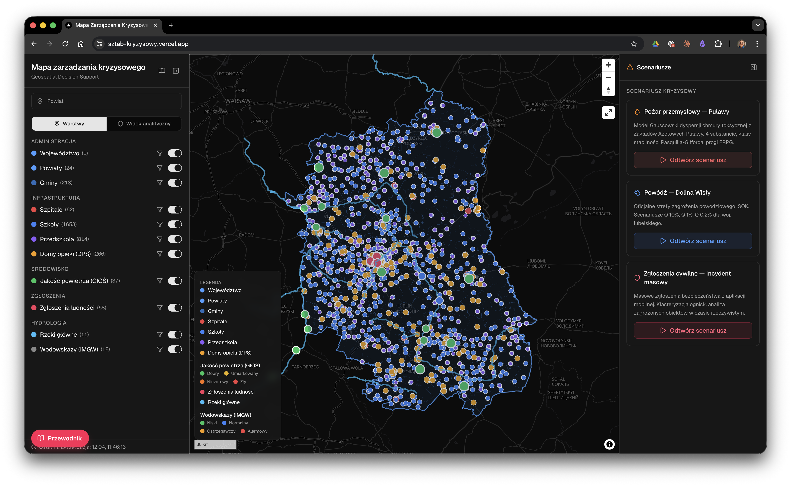
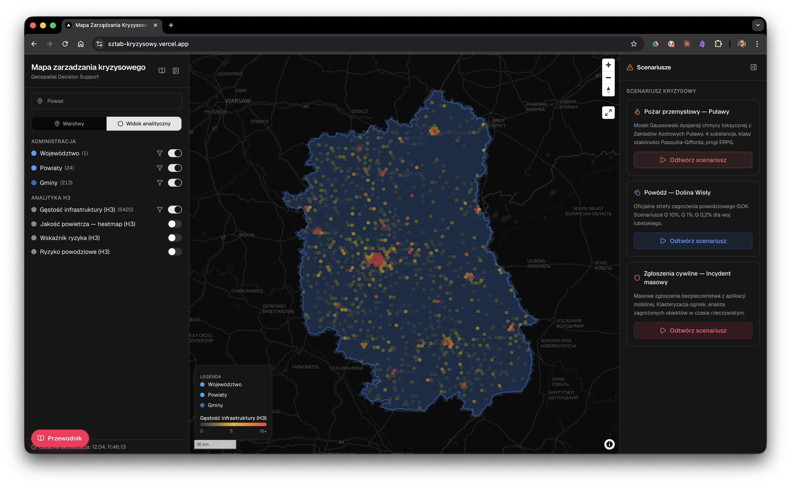
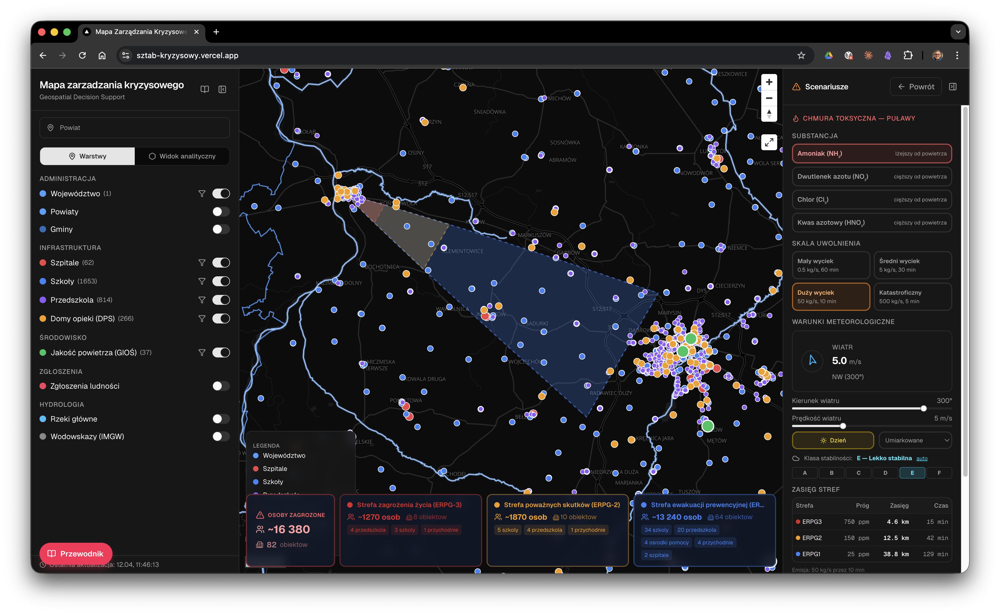
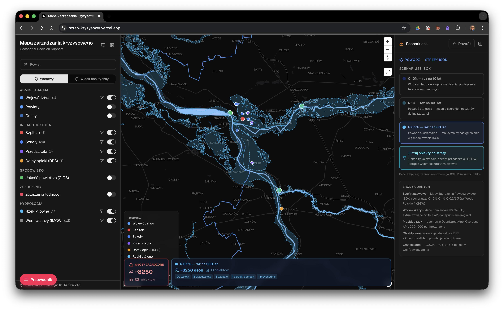
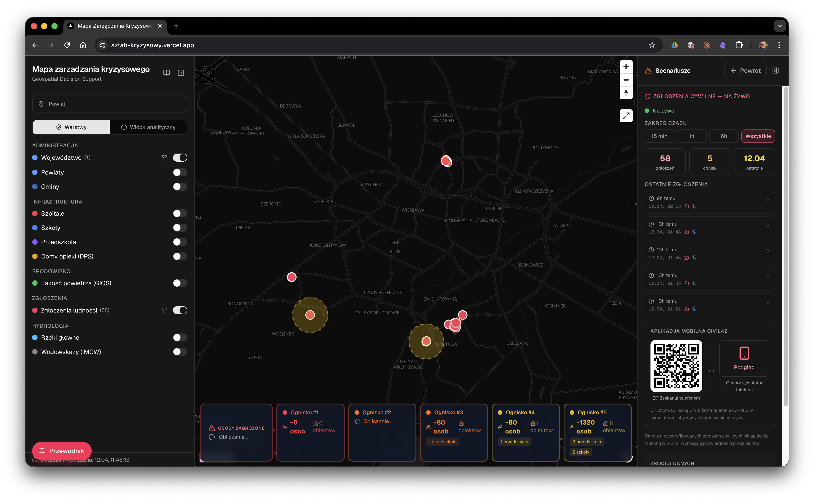
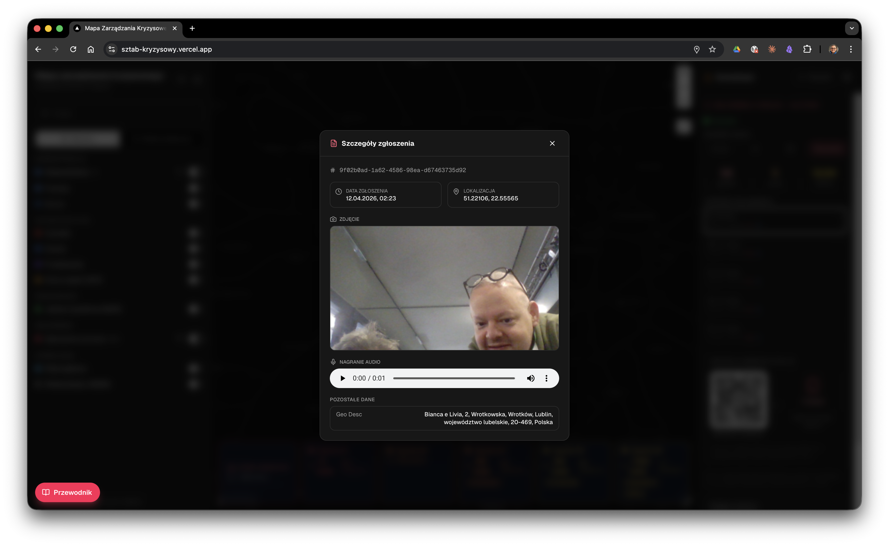
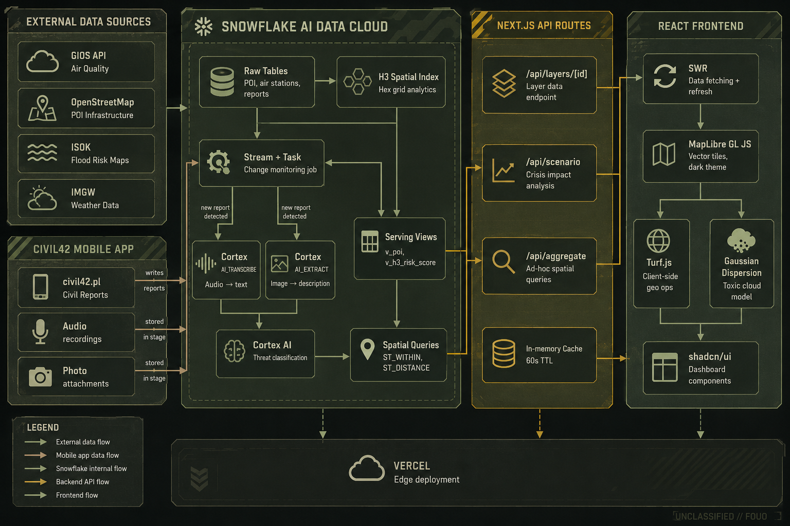

# Sztab Kryzysowy

Geospatial Decision Support Platform for crisis management in the Lubelskie Voivodeship, Poland.

Built for the **[civil42.pl](https://civil42.pl) hackathon** — special task of the Marshal of the Lubelskie Voivodeship based on the [official task brief](zadanie_województwo.pdf).

**Live demo:** [sztab-kryzysowy.vercel.app](https://sztab-kryzysowy.vercel.app)

---



## Overview

Interactive map dashboard for visualizing geospatial data layers, running crisis scenarios, and supporting decision-making during emergencies. The platform is designed as a universal geospatial tool — crisis simulation is one of multiple use cases.

### Key Features

- **Multi-layer map** with POI infrastructure (hospitals, schools, kindergartens, care homes), air quality stations (GIOS), civil reports, and administrative boundaries
- **H3 hexagonal analytics** — density heatmaps, air quality interpolation, risk scoring with zoom-dependent resolution
- **Crisis scenarios** — toxic cloud simulation (Pulawy chemical plant) with wind/time parameters, real-time population impact analysis per threat zone via Snowflake spatial intersection
- **Flood risk mapping** — ISOK flood zone overlay with Q10/Q100/Q500 return periods and infrastructure impact assessment
- **Spatial filtering** — click admin boundaries to filter data within a region
- **AI report processing** — Snowflake Cortex AI pipeline: Stream monitors new reports, AI_TRANSCRIBE converts audio to text, AI_EXTRACT describes photo content, then classifies reports by threat category and severity
- **Live data refresh** — civil reports update every 10 seconds
- **Dual map modes** — toggle between point-based and H3 analytical views

### Screenshots

| Widok analityczny H3 | Scenariusz: Chmura toksyczna |
|:---:|:---:|
|  |  |

| Scenariusz: Powódź ISOK | Scenariusz: Zgłoszenia cywilne |
|:---:|:---:|
|  |  |

| Symulator aplikacji mobilnej CIVIL42 | Szczegóły zgłoszenia |
|:---:|:---:|
|  |  |

## Architecture



## Tech Stack

| Layer | Technology |
|-------|-----------|
| Frontend | Next.js 16, TypeScript, Tailwind CSS v4, shadcn/ui |
| Map | MapLibre GL JS via @vis.gl/react-maplibre |
| Geo | @turf/turf (client-side), Snowflake GEOGRAPHY (server-side) |
| Data | Snowflake AI Data Cloud (key-pair JWT auth), H3 spatial indexing, Cortex AI |
| Deploy | Vercel |

## Project Structure

```
sztab-kryzysowy/
├── frontend/          # Next.js application
│   ├── src/
│   │   ├── app/       # Pages + API routes
│   │   ├── components/# UI components (map, dashboard, scenario)
│   │   ├── hooks/     # Data fetching, scenario state
│   │   ├── lib/       # Utilities, Snowflake client, scenarios
│   │   └── types/     # TypeScript interfaces
│   └── layer-registry.json  # Layer configuration (declarative)
├── snowflake/
│   ├── sql/           # DDL: tables, views, H3 grid
│   └── seed/          # Data loading scripts (GIOS, OSM POIs)
└── docs/              # Screenshots
```

## Getting Started

### Prerequisites

- Node.js 20+
- Snowflake account with SZTAB_DB database populated (see `SNOWFLAKE.md`)

### Setup

```bash
cd frontend
npm install
cp .env.example .env.local  # Configure Snowflake credentials
npm run dev
```

### Environment Variables

```
SNOWFLAKE_ACCOUNT=...
SNOWFLAKE_USER=...
SNOWFLAKE_PRIVATE_KEY=...    # Base64-encoded RSA key
SNOWFLAKE_DATABASE=SZTAB_DB
SNOWFLAKE_SCHEMA=PUBLIC
SNOWFLAKE_WAREHOUSE=SZTAB_WH
```

## Team

Projekt stworzony na hackathonie **civil42.pl** przez zespol **Sztab Kryzysowy**:

- **Pawel Manowiecki** — [pawel@datamano.com](mailto:pawel@datamano.com)
- **Krzysztof Rzymkowski**
- **Radek Sosnowski**
- **Michal Karpinski**

## License

Non-Commercial Open Source License — wolne do użytku niekomercyjnego, modyfikacji i dalszego rozwoju pod warunkiem publicznej dystrybucji. Użycie komercyjne wymaga zgody twórców. Szczegóły w pliku [LICENSE](LICENSE).
